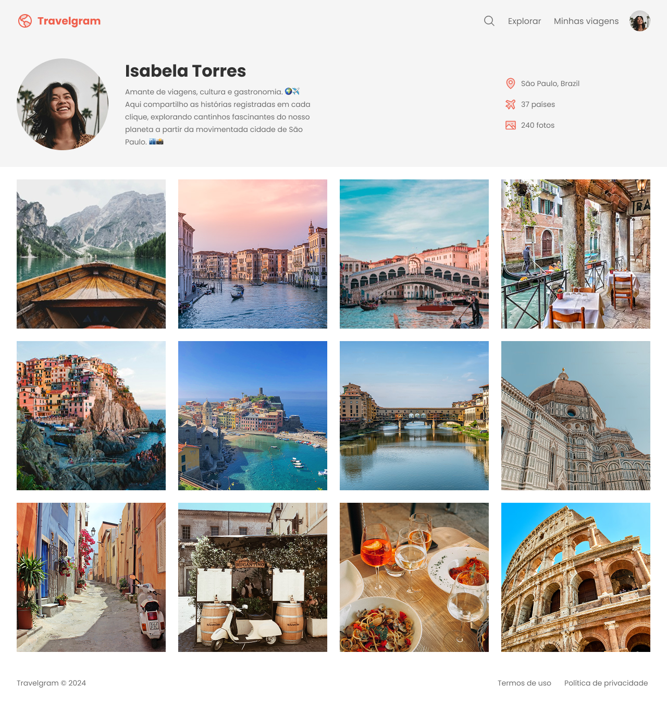

<h1 align="center"> 🌍 Perfil de Viagens — Interface de Rede Social para Viajantes </h1>

Este projeto é uma interface de perfil de usuário voltada para uma rede social de compartilhamento de experiências de viagem. Desenvolvido no Figma, o layout destaca informações essenciais de um viajante, como nome, foto de perfil, localização atual e estatísticas de viagem. Abaixo, uma galeria responsiva exibe fotos das viagens realizadas, proporcionando uma visualização imersiva das experiências vividas.

  <a href="#-tecnologias">Tecnologias</a>&nbsp;&nbsp;&nbsp;|&nbsp;&nbsp;&nbsp;
  <a href="#-projeto">Projeto</a>&nbsp;&nbsp;&nbsp;|&nbsp;&nbsp;&nbsp;
  <a href="#-layout">Layout</a>&nbsp;&nbsp;&nbsp;|&nbsp;&nbsp;&nbsp;
  <a href="#memo-licença">Licença</a>

 

  

## 🚀 Tecnologias

Esse projeto foi desenvolvido com as seguintes tecnologias:

- HTML e CSS
- Git e Github
- Figma

## 💻 Projeto

O projeto visa praticar conceitos de UI/UX, hierarquia visual e responsividade, simulando um perfil de rede social dedicado a viajantes. É uma excelente base para desenvolvedores e designers que desejam explorar interfaces voltadas para experiências e estilo de vida.

- [Acesse o projeto finalizado, online](https://gelzieny.github.io/perfil-de-viagens/)

## 🔖 Layout

Você pode visualizar o layout do projeto através [Perfil de Viagens](https://www.figma.com/design/murLPzjRZNBvgAL6Uf9ZHM/Perfil-de-viagens--Community---Copy-?node-id=0-1&p=f&t=gCsYiSQVlfcqte5k-0). É necessário ter conta no [Figma](https://figma.com) para acessá-lo.

---

Feito com ♥ by Gelzieny
